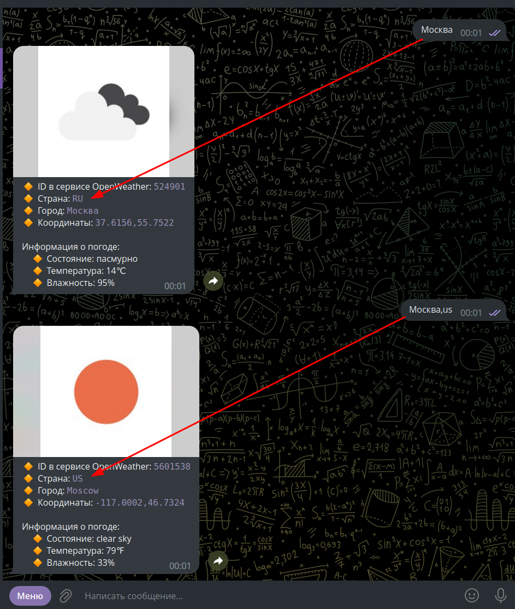
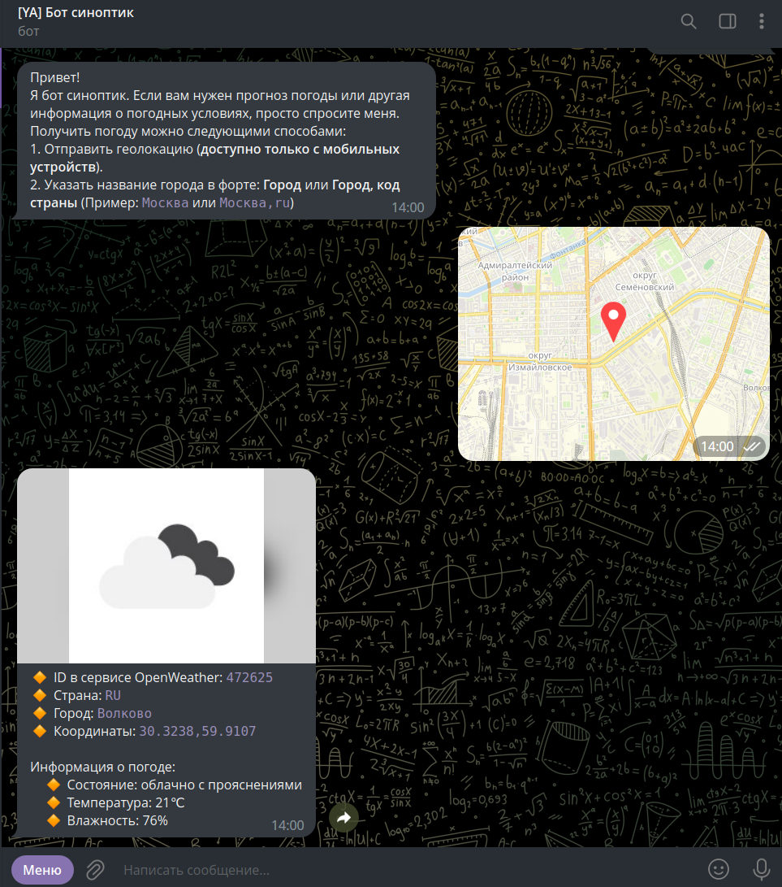
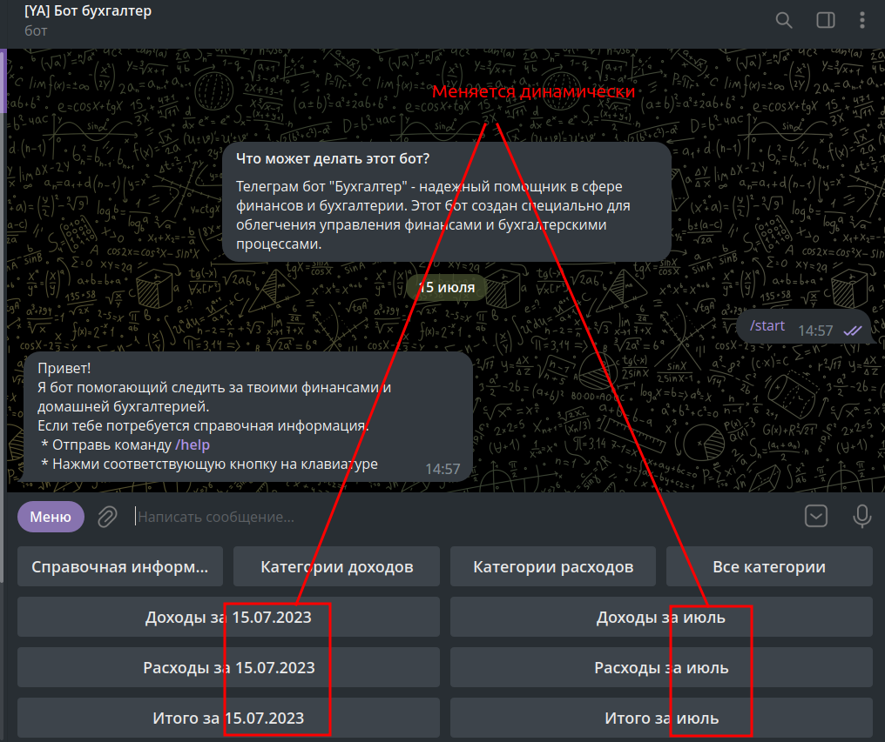
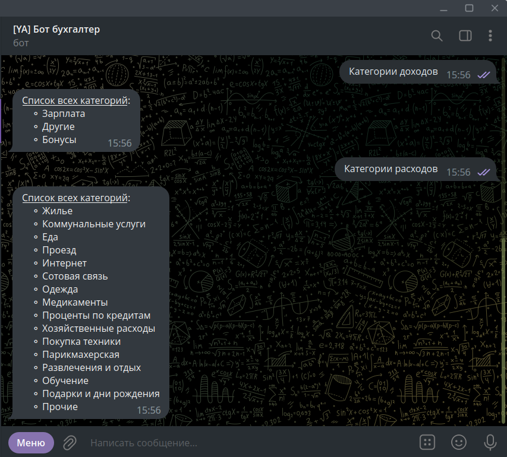
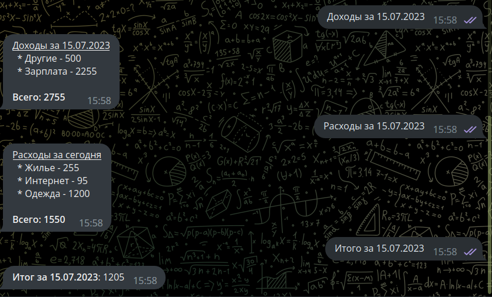
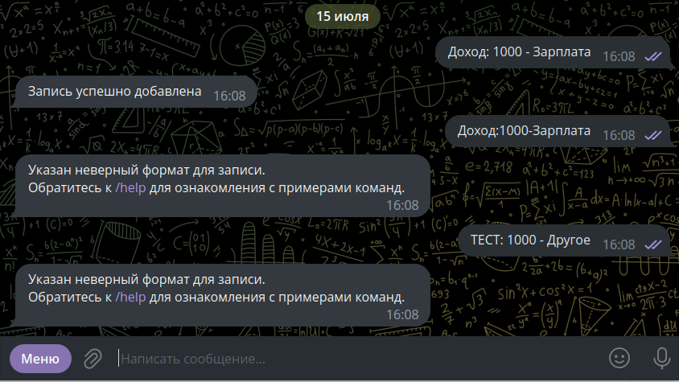
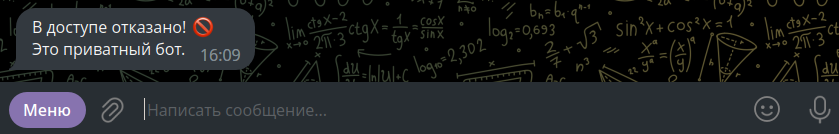

# Telegram Bots

### UPD

* [12.07.2023] - Удален бот, который использовал бесконечный цикл

## Установка

```
Используемый стек:
* PHP ^8.0
* Composer ^2.0
```

1. Зарегистрировать бота в телеграмме и получить токен.
2. Переименовать `config.php.example` в `config.php` и заполнить константу токен (см. комментарии в файле)
3. Установить composer пакеты: `composer i`
4. После размещения бота на хостинге необходимо его привязать (`setWebhook`).
    * Пример: если бот доступен по url `https://example.com/bot`, привязать его можно выполнив запрос: `https://api.telegram.org/bot{BOT_TOKEN}/setWebhook?url=https://example.com/bot` (наличие ssl - **обязательно**).
    * Проверить статус бота можно, выполнив запрос: `https://api.telegram.org/bot{BOT_TOKEN}/getWebhook`

## Реализованные боты

### simple-bot

Реализован "эхо" функционал, то есть отвечает вам сообщением, который вы написали. Также реализован функционал отправки
случайного изображения - если боту написать `photo`/ Пришлет случайное изображение из директории `simple-bot/img`
(файлы можно заменить своими).

> [Пример работающего SimpleForStudyBot бота](https://t.me/SimpleForStudyBot "Пример работающего SimpleForStudyBot бота")

### tba-php-sdk

В данном боте помимо эхо функционала реализованно:

**Команды**:

* `/photo` - отправляется случайное изображение из директории `remote/tba-php-sdk/img` (файлы можно заменить своими).
* `/document` - отправляется случайное документ из директории `remote/tba-php-sdk/docs` (файлы можно заменить своими).
* `/video` - отправляется случайное видео из директории `remote/tba-php-sdk/videos` (файлы можно заменить своими).
* `/sticker` - Отправляет случайный стикер из массива `$arrIdStickers` (массив находится в `remote/tba-php-sdk/Utils/TelegramBotApiHelper`,
  можно добавить или заменить своими).
* `/start` - Вызывает простую клавиатуру в которой можно **отправить контакт** (работает на ПК и на смартфоне),
  **отправить свою локацию** (работает только на смартфоне). Реализован функционал перехода на другую клавиатуру и возврата к
  первой, а также возможность убрать клавиатуру (именно убрать, а не скрыть в значок).
* `/help` - вызывает встроенную клавиатуру, в которой реализовано переход по двум ссылкам. Также реализована
  "Функциональная кнопка" (в конкретном боте после её клика отрабатывает функция, которая изменяет текст и добавляет время клика).

**Остальной функционал**:

* При отправке любого стикера боту - вы получите его `ID`.
* При отправке `location:longitude,latitude` - бот ответит ссылкой на гугл карту (пример: `location:55.753220, 37.622513`).

> [Пример работающего TbaPhpSdkBot бота](https://t.me/TbaPhpSdkBot "Пример работающего TbaPhpSdkBot бота")

### @ya_translation-bot-v1

Бот переводчик (v1), перевод фраз осуществляется с помощью `dejurin/php-google-translate-for-free`. Доступные переводы:

* С Английского на Русский
* С Русского на английский

Есть возможность переводить как слова, так и словосочетания и предложения. Реализована обработка ошибок, если в бот отправить
фото, видео, стикер или какой-то документ, пользователю вернется сообщение, что бот работает только с текстом.

Часть данных храниться в БД (запрос на создание нужной таблицы находится в поддиректории: FAQ).

> [Пример работающего "\[YA\] Бот переводчик v1"](https://t.me/ya_translation_bot "Пример работающего [YA] Бот переводчик v1")

### @ya_weather_v1_bot

Бот переводчик v2. Отличие от Бота переводчика v1 заключается в:

* Определение на каком языке отправлен текст происходит автоматически.
* Так как данные для переключения языка больше не нужны - БД в боте не используется.

> [Пример работающего "\[YA\] Бот переводчик v2"](https://t.me/ya_translation_v2_bot "Пример работающего [YA] Бот переводчик v2")

### @ya_weather_v1_bot

Реализация бота синоптика. Получение информации о погоде идет через взаимодействие с API сервиса Open Weather. Получить информацию
о погоде возможно двумя способами:

1. Отправить геолокацию (доступно только с мобильных устройств).
2. Указать название города в форте: Город или Город, код страны (Пример: Москва или Москва,ru)


<details>
  <summary>Скриншот: "Пример получения погоды с указанием 'названия' города или 'указанием города, код страны'"</summary>


</details>

<details>
  <summary>Скриншот: "Пример получения погоды при отправке геолокации (доступно только с мобильных устройств)"</summary>


</details>

> [Пример работающего "\[YA\] Бот синоптик"](https://t.me/ya_weather_v1_bot "Пример работающего [YA] Бот синоптик")

### @ya_accountant_bot

Реализация бота бухгалтера. Помогает следить за финансами и домашней бухгалтерией. Реализован функционал:

* Добавления Доходов / Расходов. Эти категории привязываются к определенной группе, а сами данные хранятся в БД. Структура
* Формирование отчетов:
    * Доходы / Расходы за день.
    * Доходы / Расходы за месяц.
    * Итого за текущий день / месяц - разница между доходом и расходом

Есть возможность вывести текущие категории, которые закреплены за доходами и расходами. Также реализована проверка, когда
при попытке добавить доход или расход указывается не корректный формат. Реализовано ограничение доступа к боту по ID телеграмма (`TELEGRAM_USER_ID`).

<details>
  <summary>Скриншот: "Общий интерфейс управления"</summary>


</details>

<details>
  <summary>Скриншот: "Вывод категорий закрепленных за Доходами/Расходами"</summary>


</details>

<details>
  <summary>Скриншот: "Вывод информации за текущий день: 'Доходы', 'Расходы', 'Итого'"</summary>


</details>

<details>
  <summary>Скриншот: "Процесс добавления дохода (корректный и не корректный формат)"</summary>


</details>

<details>
  <summary>Скриншот: "Попытка обратиться к боту, если ID телеграмма не совпадает с ID указанным в TELEGRAM_USER_ID"</summary>


</details>

> ["\[YA\] Бот бухгалтер"](https://t.me/ya_accountant_bot "[YA] Бот бухгалтер").
> Так как доступ настроен на мой ID телеграмма - вы увидите ошибку доступа.

---

### Для отладки в ботах реализован функционал записи в логи

* Возникающие исключения отлавливаются в `try/catch` и пишутся в файл `try_catch_logs.txt`, который находится в папке с ботом.
* Для записи ответов с телеграмм бота и запросов с вашей стороны реализован методы `addToLogs()` / `writeToLogs()`.
